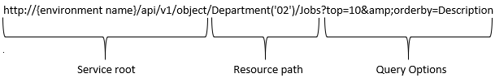

# REST

As of Ultimo version 18.04, the possibility to connect to a REST API has been added to Ultimo.

### Requesting data

With the GET request method it is possible for API clients to retrieve information from Ultimo.

The basic URL for requesting entities has the following format:

The service root is the same for every request or query. It contains the environment name, which is a string to identify your Ultimo environment. The resource path refers to the specific information you request. The query options determine which parts of this information are presented and how.

### Authentication

When sending a request to the REST API, an API key should be provided in the header of the request. The API key can be generated in Ultimo.

### Headers

The headers of a request contains general configurations. It contains the following options:

* The API key must be specified in the following format:  `ApiKey: {API KEY}` 
* You can specify in which language you receive the response. If not specified the default user language is returned. The language is returned in the header of the response. You can specify the language in the following format:  `Accept-language: NL`

### Response format

Ultimo REST API always returns a JSON response.

