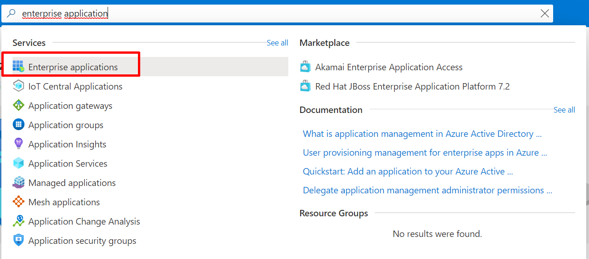

# Azure Authentication

### Creating new enterprise application

**If you want to separate ultimo production and ultimo test, then we recommend to create two enterprise applications.**

- Go to your Azure Active Directory and search for enterprise applications.  

- Click on new application.  

- Click on create your own application  
  

- Create the application with the name Ultimo and the setting integrate any other application you don't find in the gallery \(Non-gallery\) and click on the bottom side on create.  

### Setup single sign on

- Click on set-up single sign on.  

- Click on SAML.  

- Click on Upload metadata file.  

- Select the xml file that was provided in the mail.  

- Check if the input is correct and click on save.  
 Identifier production: https://&lt;customerurl&gt;.ultimo.net/Saml2  
 Reply URL production: https://&lt;customerurl&gt;.ultimo.net/Saml2/Acs  
 Identifier test: https://&lt;customerurl&gt;-test.ultimo.net/Saml2  
 Reply URL test: https://&lt;customerurl&gt;-test.ultimo.net/Saml2/Acs

Check image below for details:  

### User assignment 

- Click on Users and groups  

- Click on add user/group  

- Click on none selected and invite users in case u want to invite users to the application, otherwise click on select a role and add the security group within Azure AD to grant access.

**Note: If you don’t want to provide a domain account to Ultimo, please invite the consultant so he can use his Ultimo e-mail to test the SSO during implementation.**

- If you invite users, then they have to accept the mail to gain access.  
  

- Send the following information to Ultimo so they can start the implementation:

App Federation Metadata Url  
Federation Metadata XML \(Download XML and add as attachment\)  
Domain account e-mail or **invitation to Ultimo app in previous step.**  
Domain account password or **invitation to Ultimo app in previous step.**  

