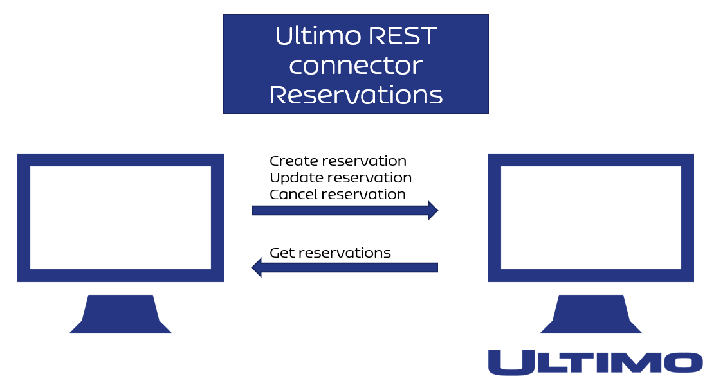

# Reservations

✅ Professional ✅ Premium ✅ Enterprise

There are basically two flows in the connector. One flow sends data to Ultimo and one flow gets data from Ultimo. Ultimo always acts as a server in this regard. The flows are depicted below:

#### **Reservation \(RESTInterfaceReservations\) with workflows:**









