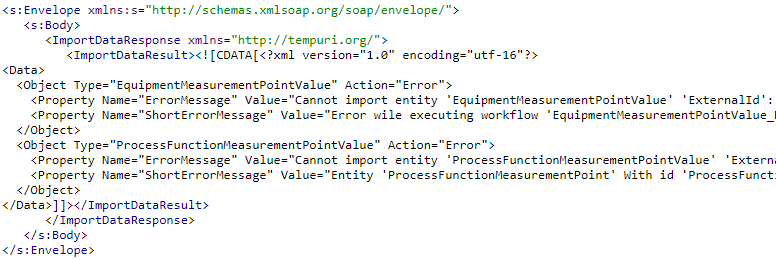

# SOAP \(XML\)

#### WSDL:

`https://customer.ultimo.com/webservices/soapconnector.svc?wsdl`

#### The body contains the following information:

| Parameter | Description |
| :--- | :--- |
| importName | Fixed value “IOT-MEASUREMENT” |
| username | Username that has the rights to use the IoT-connector |
| password | Password of the user |
| importData | The measurements XML in a &lt;!\[CDATA\[ ..\]\]&gt; block |

#### Example:

The response will contain the imported measurements in the internal Ultimo data structure, including the generated IDs. When a measurement is imported successfully, the attribute _Action_ is “Insert”. Example response:


Status: 200 OK


When the measurement is not accepted by the Ultimo business rules or an error occurs during the processing of the measurement, the _Action_ attribute will have the value “Error”. Example of a response that contains errors:


Status: 200 OK


When the connector cannot be reached at all \(i.e. when username or password is incorrect\), the format of the error message will be as follows:


Status: 500 Internal Server Error


