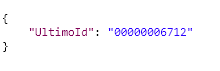
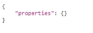
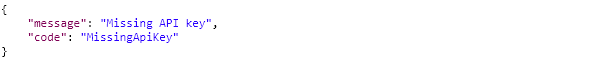

# Cancel reservation

This workflow allows third parties to cancel an existing reservation for a specific room with specified times.

The following required parameter is used in the request.

| Parameter | Description |
| :--- | :--- |
| UltimoId | The internal Ultimo Id of a reservation for the room. |

### Technical details 

Basic URL \(POST\):

`https://customer.ultimo.com/api/V1/Action/REST_CancelReservation`

Header data:

| ApiKey | Description |
| :--- | :--- |
| ApiKey | Request an API key at \(application manager or consultant\) |
| ApplicationElementId | Fixed value “5d5a10ee-7b14-4dd4-8683-33822ea56f12” |

Body \(example\):

#### Normal response:


Status: 200 OK


#### Response when the API-key is invalid:


Status: 401 Unauthorized


