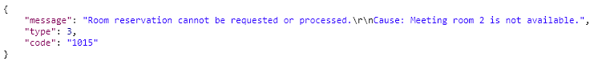

# Cancel reservation

This workflow allows third parties to cancel an existing reservation for a specific room with specified times.

The following required parameter is used in the request.

| Parameter | Description |
| :--- | :--- |
| UltimoId | The internal Ultimo Id of a reservation for the room. |

### Technical details 

Basic URL \(POST\):

`https://customer.ultimo.com/api/V1/Action/REST_CancelReservation`

Header data:

| ApiKey | Description |
| :--- | :--- |
| ApiKey | Request an API key at \(application manager or consultant\) |
| ApplicationElementId | Fixed value “5d5a10ee-7b14-4dd4-8683-33822ea56f12” |

Body \(example\):

Normal response:

Status: 200 OK

Response when the API-key is invalid:

Status: 401 Unauthorized

### Technical details 

Basic URL \(POST\):

`https://customer.ultimo.com/api/V1/Action/REST_UpdateReservation`

Header data:

| Parameter | Description |
| :--- | :--- |
| ApiKey | Request an API key at \(application manager or consultant |
| ApplicationElementId | Fixed value “3736d834-fa5e-4edc-9abd-f38962ff8afd” |

Body \(example\):

Normal response:

Status: 200 OK

Responses when the action is not allowed:

Status: 400 Bad Request

Response when the API-key is invalid:

  
In this case it is not allowed to make a reservation for a room that already has a reservation at the specified time. Ultimo will not process this action.

Status: 400 Bad Request

In this case it is not allowed to modify a room reservation that lies in the past. Ultimo will not process this action.

Response when the API-key is invalid:

Status: 401 Unauthorized

