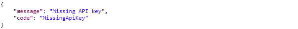

# Create reservation

This workflow allows third parties to send a new reservation for a specific room with specified times.

The following parameters are used in the request. These are all required.

<table>
  <thead>
    <tr>
      <th style="text-align:left"><b>Parameter</b>
      </th>
      <th style="text-align:left"><b>Description</b>
      </th>
    </tr>
  </thead>
  <tbody>
    <tr>
      <td style="text-align:left"><b>ExternalId</b>
      </td>
      <td style="text-align:left">This is the Id used for the reservation in the system of the third party.</td>
    </tr>
    <tr>
      <td style="text-align:left"><b>Description</b>
      </td>
      <td style="text-align:left">The description of the reservation for the room.</td>
    </tr>
    <tr>
      <td style="text-align:left"><b>SpaceId</b>
      </td>
      <td style="text-align:left">This is the internal Ultimo Id of a room/space (entity).</td>
    </tr>
    <tr>
      <td style="text-align:left"><b>StartTime</b>
      </td>
      <td style="text-align:left">
        <p>The start time (datetime) of reservation.</p>
        <p>Allowed formats:</p>
        <ul>
          <li>yyyy-MM-dd hh:mm:ss (i.e. 2018-08-21 15:21:59)</li>
          <li>UTC: yyyy-MM-ddThh:mm:ssZ (i.e. 2018-08- 20T15:17:59Z)</li>
        </ul>
      </td>
    </tr>
    <tr>
      <td style="text-align:left"><b>EndTime</b>
      </td>
      <td style="text-align:left">
        <p>The end time (datetime) of reservation.</p>
        <p>Allowed formats:</p>
        <ul>
          <li>yyyy-MM-dd hh:mm:ss (i.e. 2018-08-21 15:21:59)</li>
          <li>UTC: yyyy-MM-ddThh:mm:ssZ (i.e. 2018-08- 20T15:17:59Z)</li>
        </ul>
      </td>
    </tr>
    <tr>
      <td style="text-align:left"><b>ApplicantId</b>
      </td>
      <td style="text-align:left">The Id from the applicant of the reservation (entity employee in Ultimo).</td>
    </tr>
  </tbody>
</table>

When these parameters are properly filled in, Ultimo will give a HTTP 200 response with the following properties:

| Parameter | Description |
| :--- | :--- |
| UltimoId | The internal Ultimo Id of a reservation for the room \(ReservationLine Id\). |

### Technical details 

Basic URL \(POST\):

`https://customer.ultimo.com/api/V1/Action/REST_CreateReservation`

Header data:

| Parameter | Description |
| :--- | :--- |
| ApiKey | Request an API key at \(application manager or consultant\) |
| ApplicationElementId | Fixed value “0167a94a-5dae-4efe-bf13-029a47728b97” |

Body \(example\):

```text
{
    "ExternalId"
```


Normal response:

Status: 200 OK


Response when the API-key is invalid:

Status: 401 Unauthorized

Response when the action is not allowed:

Status: 400 Bad Request


Response when the API-key is invalid:

In this case it is not allowed to make a reservation for a room that already has a reservation at the specified time. Ultimo will not process this action.

Response when the API-key is invalid:

Status: 401 Unauthorized




