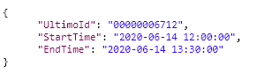
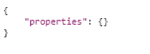
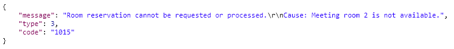
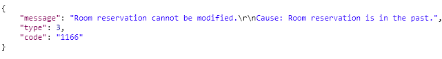

# Update reservation

This workflow allows third parties to update an existing reservation for a specific room with specified times.

The following parameters are used in the request. These are all required.

<table>
  <thead>
    <tr>
      <th style="text-align:left">Parameter</th>
      <th style="text-align:left">Description</th>
    </tr>
  </thead>
  <tbody>
    <tr>
      <td style="text-align:left">UltimoId</td>
      <td style="text-align:left">The internal Ultimo Id of a reservation for the room (ReservationLine
        Id).</td>
    </tr>
    <tr>
      <td style="text-align:left">StartTime</td>
      <td style="text-align:left">
        
The start time (datetime) of reservation.

        
Allowed formats:

        <ul>
          <li>yyyy-MM-dd hh:mm:ss (i.e. 2018-08-21 15:21:59)</li>
          <li>UTC: yyyy-MM-ddThh:mm:ssZ (i.e. 2018-08- 20T15:17:59Z)</li>
        </ul>
      </td>
    </tr>
    <tr>
      <td style="text-align:left">EndTime</td>
      <td style="text-align:left">
        
The end time (datetime) of reservation.

        
Allowed formats:

        <ul>
          <li>yyyy-MM-dd hh:mm:ss (i.e. 2018-08-21 15:21:59)</li>
          <li>UTC: yyyy-MM-ddThh:mm:ssZ (i.e. 2018-08- 20T15:17:59Z)</li>
        </ul>
      </td>
    </tr>
  </tbody>
</table>

### Technical details 

Basic URL \(POST\):

`https://customer.ultimo.com/api/V1/Action/REST_UpdateReservation`

Header data:

| Parameter | Description |
| :--- | :--- |
| ApiKey | Request an API key at \(application manager or consultant |
| ApplicationElementId | Fixed value “3736d834-fa5e-4edc-9abd-f38962ff8afd” |

Body \(example\):

Normal response:


Status: 200 OK


#### Responses when the action is not allowed:


Status: 400 Bad Request


#### Response when the API-key is invalid:

  
In this case it is not allowed to make a reservation for a room that already has a reservation at the specified time. Ultimo will not process this action.


Status: 400 Bad Request


In this case it is not allowed to modify a room reservation that lies in the past. Ultimo will not process this action.

#### Response when the API-key is invalid:


Status: 401 Unauthorized


### 

