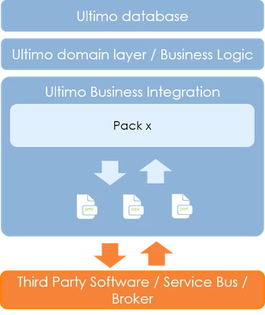

# Introduction

Ultimo Business Integration provides an API to Ultimo for third party applications. The API offers the following functions:

* Insert data
* Update data
* Delete data
* Retrieve data

Ultimo is able to process the received data using the built in business logic. 

Ultimo Business Integration can be described as:

* A default integration platform
* Offering import & export functionalities
* Based on XML, CSV or JSON
* Accessible via webservices

Ultimo Business Integration offers:

* Various default integrations
* Support for standards like LDAP and OCI
* Additional interfaces created by our consultants
* Integration with files or webservice requests
* Possibilities for XSL transformation
* Default logging and rollback mechanisms

The following types of communications are supported to access the API:



